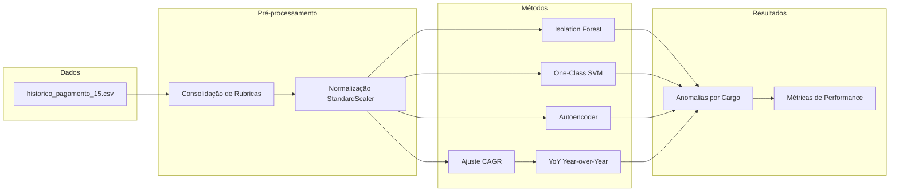
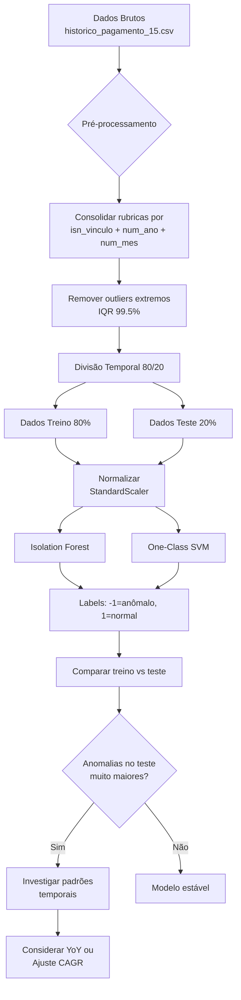
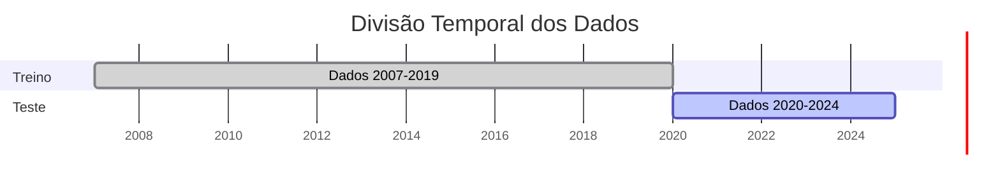
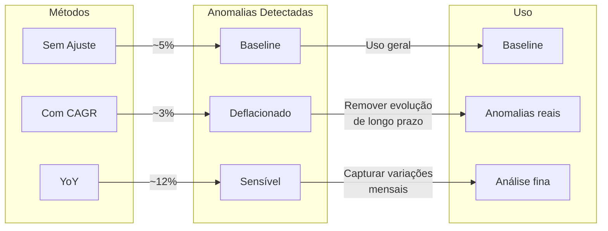
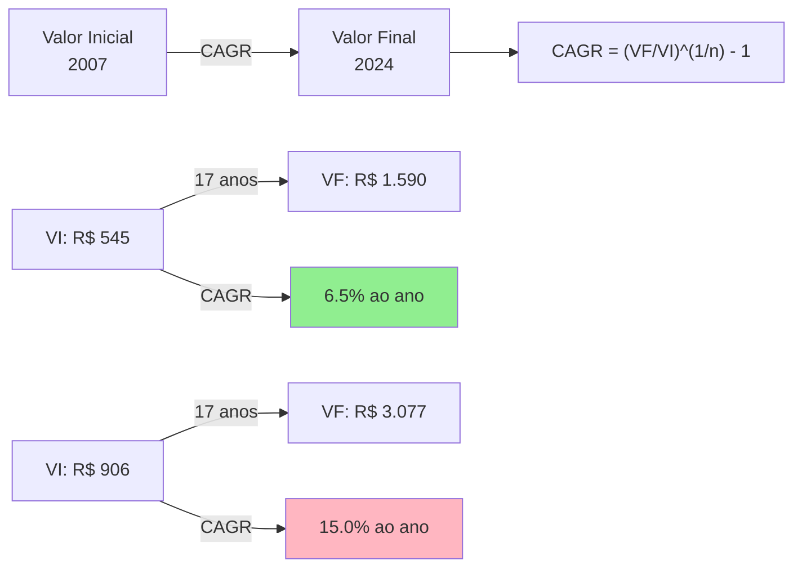
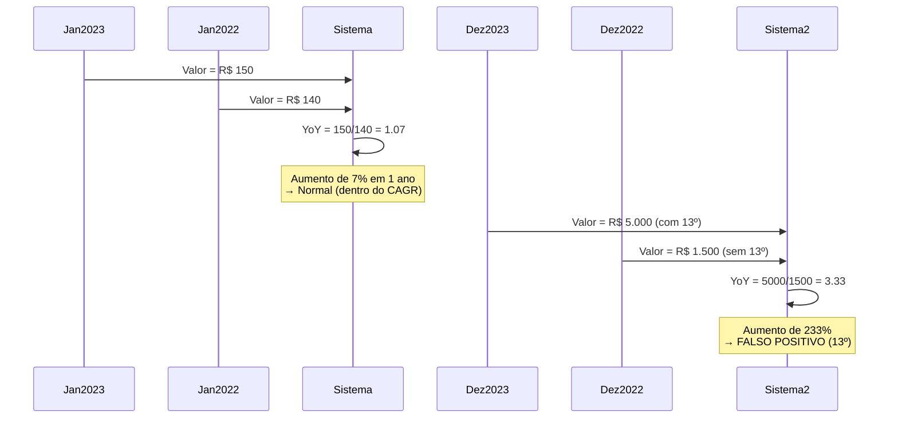
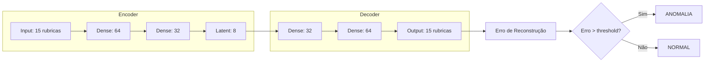

# ConfereAI — Diagramas

## Arquitetura Geral



## Pipeline de Detecção de Anomalias



## Divisão Temporal 80/20



## Comparação de Métodos



## Detecção de Anomalias por Cargo

```mermaid
flowchart TD
    A[Selecionar Cargo<br/>ex: P115] --> B[Dados do Cargo]
    
    B --> C{Pivot Table<br/>isn_vinculo × isn_rubrica}
    
    C --> D{Rubricas suficientes?<br/>min 30 registros}
    
    D -->|Não| E[跳过 cargo]
    D -->|Sim| F[Calcular CAGR por rubrica]
    
    F --> G{Usar método?}
    
    G -->|CAGR| H[Deflacionar valores<br/>para ano-base]
    G -->|YoY| I[valor_mês /<br/>valor_mesmo_mês_ano_anterior]
    G -->|Nenhum| J[Valores originais]
    
    H --> K[Normalizar StandardScaler]
    I --> K
    J --> K
    
    K --> L[Isolation Forest<br/>contamination=0.05]
    K --> M[One-Class SVM<br/>nu=0.05]
    
    L --> N[Score anomalias]
    M --> N
    
    N --> O[Salvar CSV<br/>anomalias_{cargo}.csv]
    O --> P[Próximo Cargo]
```

## CAGR — Compound Annual Growth Rate



## YoY — Year-over-Year



## Comparação Sem vs Com Ajuste

```mermaid
flowchart TD
    subgraph Sem Ajuste
        A1[Valor 2007: R$ 100] --> A2[Valor 2024: R$ 500]
        A2 --> A3[Isolation Forest]
        A3 --> A4[Anomalia detectada<br/>+400% parece suspeito]
    end
    
    subgraph Com CAGR
        B1[Valor 2007: R$ 100] --> B2[Deflacionado 2024: R$ 100]
        B2 --> B3[Isolation Forest]
        B3 --> B4[Normal<br/>sem anomalia]
    end
    
    subgraph Com YoY
        C1[Jan 2023: R$ 150] --> C2[Jan 2022: R$ 140]
        C2 --> C3[YoY = 1.07]
        C3 --> C4[Normal<br/>+7% dentro do esperado]
    end
```



## Autoencoder Architecture


