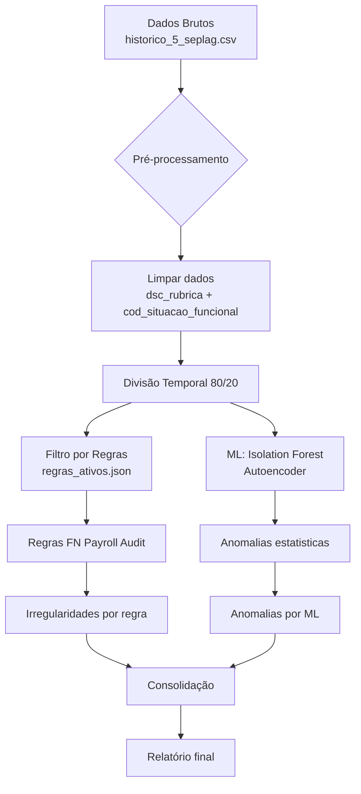
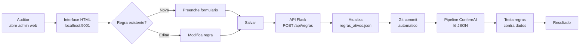
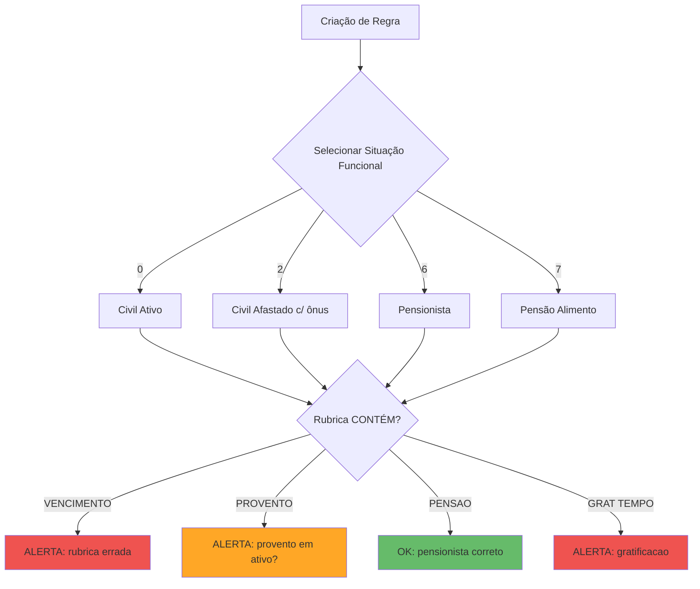
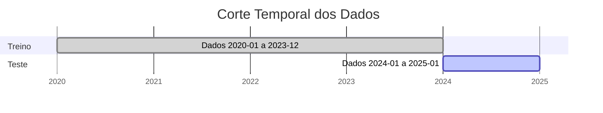
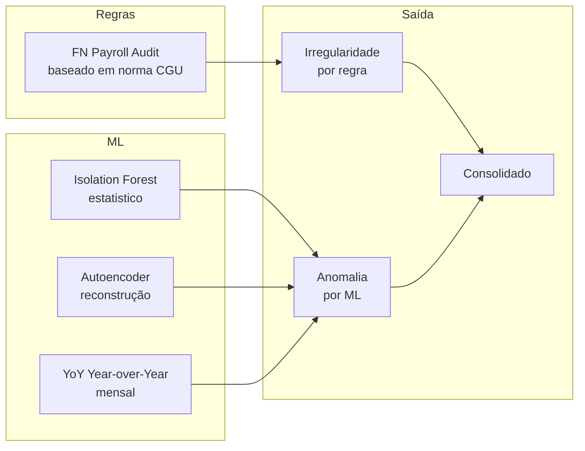
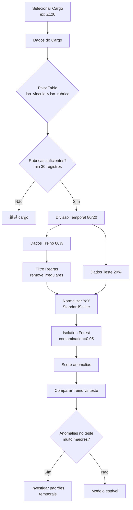

# ConfereAI — Diagramas

## Arquitetura Geral com Regras + ML



## Pipeline Completo — Dados → Resultado

```mermaid
flowchart LR
    subgraph Dados
        A[historico_5_seplag.csv<br/>163k registros<br/>2020-2025]
    end
    
    subgraph Camada 1 — Regras
        B[Admin Web<br/>regras.confereai.com]
        C[regras_ativos.json<br/>versionado git]
        D[Python: detectar_regras.py<br/>aplica regras nos dados]
    end
    
    subgraph Camada 2 — ML
        E[Filtro: remover<br/>irregularidades]
        F[Normalizar YoY<br/>StandardScaler]
        G[Isolation Forest<br/>contamination=0.05]
    end
    
    subgraph Resultado
        H[Irregularidades<br/>por regra]
        I[Anomalias<br/>por ML]
        J[Consolidado<br/>Geral]
    end
    
    A --> B --> C --> D
    D --> E
    E --> F --> G
    A --> D
    D --> H
    G --> I
    H --> J
    I --> J
```

## Admin de Regras — Interface



## Regras — Tipos de Condição



## Divisão Temporal 80/20



## Comparação de Métodos



## Detecção por Cargo



## Estrutura de Arquivos

```mermaid
filesystem
    
    .confereai/
    📁 regras/
    ├── 📄 regras_ativos.json    # Regras ativas (versionado git)
    ├── 📄 REGRAS.md             # Documentação
    └── 📁 admin/
        ├── 📄 app.py            # API Flask (:5001)
        └── 📁 static/
            └── 📄 index.html   # Admin web (dark theme)
    
    📁 data/
    ├── 📄 historico_5_seplag.csv
    ├── 📁 regras_resultados/
    │   ├── 📄 todas_violacoes.csv
    │   └── 📄 resumo_regras.json
    └── 📁 baseline_results_yoy/
    
    📁 scripts/
    ├── 📄 deteccao_regras.py
    └── 📄 baseline_yoy.py
```
